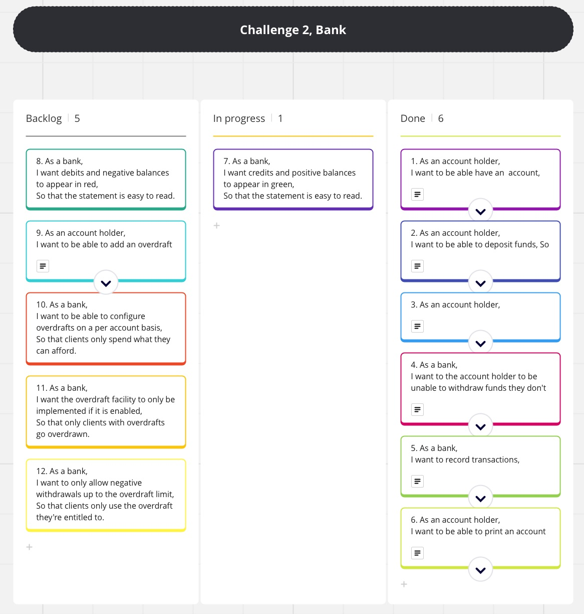
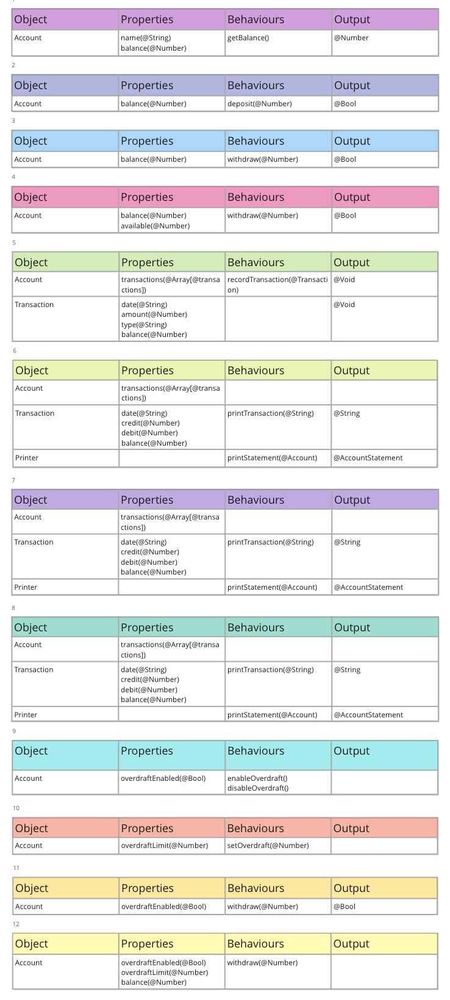
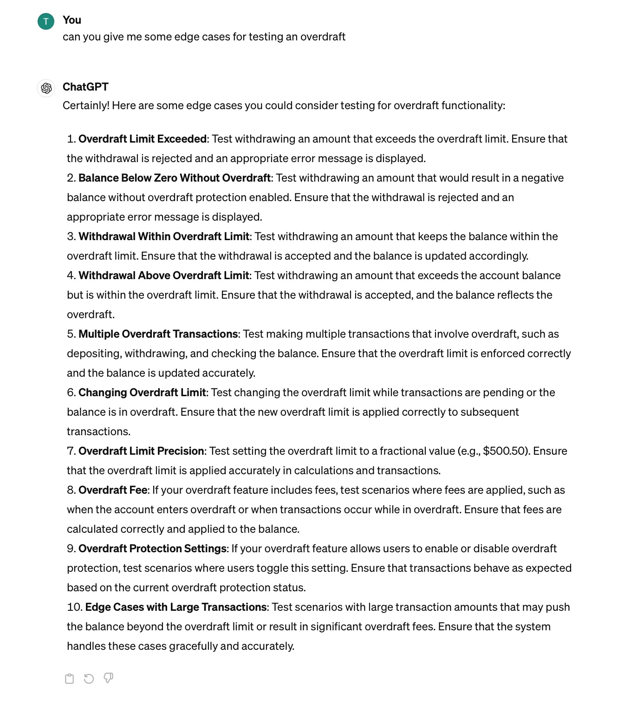

## Requirements

- A user should should see the output of the application on the terminal:
  - Access an account (assuming each user will automatically have their details loaded into the program on startup).
  - Deposit funds.
  - Withdraw funds - if they have sufficient balance to do so.
  - Print an account statement (date, amount, balance).
  - The output of the statement should be formatted so credits and positive balances appear in green text, debits and negative balances appear in red text.
  - It should be possible to add an overdraft facility to the account, so that if a withdrawal is attempted which would result in a negative balance, the withdrawal is allowed up to the value of the overdraft only.
  - This overdraft should be configurable on a per-account basis (i.e. the amount of the overdraft is not fixed across all clients) and only implemented if the account has an overdraft facility enabled.
  
## User Stories

1. As an *account holder*,\
   I want *to be able to access my account*,\
   So that *I can manage my money*.
2. As an *account holder*,\
   I want *to be able to deposit funds*\,
   So that *I can store money in my account*.
3. As an *account holder*,\
   I want *to be able to withdraw funds*,\
   So that *I can spend my money*.
4. As a *bank*,\
   I want to *the account holder to be unable to withdraw funds they don't have*,\
   So that *they only spend their money*.
5. As a *bank*,\
   I want *to record transactions*,\
   So that *the account statement is correct*.
6. As an *account holder*,\
   I want to *be able to print an account statement*,\
   So that *I can see my transactions*.
7. As a *bank*,\
   I want *credits and positive balances to appear in green*,\
   So that *the statement is easy to read*.
8. As a *bank*,\
   I want *debits and negative balances to appear in red*,\
   So that *the statement is easy to read*.
9.  As an *account holder*,\
   I want *to be able to add an overdraft facility*,\
   So that *I can get into debt*.
10. As a *bank*,\
   I want *to be able to configure overdrafts on a per account basis*,\
   So that *clients only spend what they can afford*.
11. As a *bank*,\
    I want *the overdraft facility to only be implemented if it is enabled*,\
    So that *only clients with overdrafts go overdrawn*.
12. As a *bank*,\
    I want *to only allow negative withdrawals up to the overdraft limit*,\
    So that *clients only use the overdraft they're entitled to*.

## Development Plan

The steps taken to develop this project were as follows: 

- Decompose user stories as single function
- Create domain models
- Write all tests
- Code functionality

Each user story was fully tested and functionally coded in turn. A kanban board was used to track progress:

;

## Domain Models

Domain models were built from the user stories:

;

## GAI

ChatGPT was used to generate some edge cases for overdrafts:

;

## Test Plan

Account Tests:

1. Verify that an object created using the Account class is an instance of Account.
2. Verify that the name property of the account is correctly set to given name.
3. Verify that an error is thrown when attempting to create an account with a null name.
4. Verify that the initial balance of a newly created account is zero.
5. Verify that the balance increases correctly when funds are deposited into an account with zero balance.
6. Verify that the balance increases correctly when funds are deposited into an account with a non-zero balance.
7. Verify that an error is thrown when attempting to deposit negative funds into the account.
8. Verify that the balance decreases correctly when funds are withdrawn from the account.
9. Verify that an error is thrown when attempting to withdraw negative funds from the account.
10. Verify that an error is thrown when attempting to withdraw more funds than the account balance.
11. Verify that the entire balance can be withdrawn from the account.
12. Verify that a transaction is added to the transactions array when a deposit is made.
13. Verify that a transaction is added to the transactions array when a withdrawal is made.
14. Verify that the transactions array contains instances of the Transaction class.
15. Verify that the overdraft facility can be enabled for the account.
16. Verify that the overdraft facility can be disabled for the account.
17. Verify that the overdraft limit can be set for the account.
18. Verify that no error is thrown when attempting to withdraw funds exceeding the balance with the overdraft facility enabled.
19. Verify an error is thrown when attempting to withdraw funds exceeding the balance plus the overdraft limit.
20. Verify that a withdrawal is allowed up to the overdraft limit when the overdraft facility is enabled.
21. Verify that the printAccountDetails method calls the getName method.
22. Verify that the printAccountDetails method calls the getAccountNumber method.
23. Verify that the printAccountDetails method calls the getOverdraftDetails method.
24. Verify that the printAccountDetails method calls the currentAvailable method.
25. Verify that the printAccountDetails method outputs the account details in the expected format.

Transaction Tests:

1. Verify that the getAmount method returns the correct amount of the transaction.
2. Verify that the getBalance method returns the correct total balance after the transaction.
3. Verify that the getDate method returns the correct date of the transaction.
4. Verify that the printTransaction method calls the getDate method.
5. Verify that the printTransaction method calls the getDebit method.
6. Verify that the printTransaction method calls the getCredit method.
7. Verify that the printTransaction method calls the getBalance method.

Credit Transaction Tests:

1. Verify that it inherits properties and methods from Transaction class
2. Verify that it sets credit to amount
3. Verify that it logs correct output when printTransaction is called

Debit Transaction Tests:

1. Verify that it inherits properties and methods from Transaction class
2. Verify that it sets debit to amount
3. Verify that it logs correct output when printTransaction is called

Printer Tests:

1. Verify that the correct header is printed when Printer.printStatement is called.
2. Verify that the printTransaction method is called once when there is one transaction in the array.
3. Verify that the printTransaction method is called twice when there are two transactions in the array.
4. Verify that transactions are formatted correctly when printed.
5. Verify that the printAccountDetails method of the account is called once when Printer.printAccount is called.
6. Verify that a success message is printed when a withdrawal is successful.
7. Verify that an error message is printed when a withdrawal is unsuccessful.
8. Verify that a success message is printed when a deposit is successful.
9. Verify that an error message is printed when a deposit is unsuccessful.